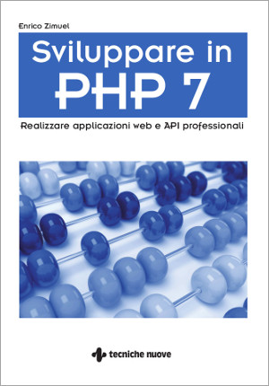

# Codici sorgenti II edizione del libro "Sviluppare in PHP 7"

Codici sorgenti della seconda edizione del libro "Sviluppare in PHP 7" di [Enrico Zimuel](https://www.zimuel.it),
[Tecniche Nuove](http://www.tecnichenuove.com/) edizioni 2019, pag. 432, ISBN 978-88-481-4031-7

I codici sorgenti della prima edizione si trovano [qui](https://github.com/ezimuel/sviluppareinphp7/releases/tag/1.0).

(C) Copyright Enrico Zimuel e Tecniche Nuove Spa
